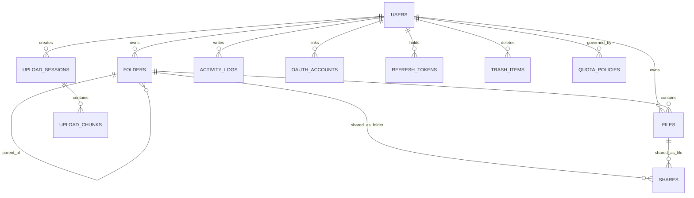

# 04-ERD.md
# StorageHub Entity Relationship Diagram

Version: 1.0
Status: Draft Enterprise

---

# 1. ERD Purpose

Dokumen ini menjelaskan hubungan antar entitas inti StorageHub agar struktur database konsisten, mudah diimplementasikan di MySQL, dan siap dipakai oleh backend FastAPI.

Fokus utama StorageHub tetap mengikuti referensi desain:
- FastAPI backend
- MySQL 8 database
- React frontend
- OAuth2/OIDC login
- Finder-like file explorer
- macOS Tahoe inspired UI
- Lightweight, responsive, self-hosted file platform

---

# 2. ERD Scope

Entitas yang dibahas:
- users
- oauth_accounts
- folders
- files
- shares
- upload_sessions
- upload_chunks
- activity_logs
- quota_policies
- refresh_tokens
- system_settings
- trash_items

---

# 3. Conceptual ERD

```text
users
  |
  |----< oauth_accounts
  |
  |----< folders
  |         |
  |         |----< folders (self reference via parent_id)
  |         |
  |         |----< files
  |
  |----< files
  |         |
  |         |----< shares
  |
  |----< upload_sessions
  |         |
  |         |----< upload_chunks
  |
  |----< refresh_tokens
  |
  |----< activity_logs
  |
  |----< trash_items

quota_policies
  |
  |----> users (via default or assignment logic)

system_settings
  |
  |----> global configuration values
```

---

# 4. Logical ERD Explanation

## 4.1 User as Core Identity
Semua data StorageHub berpusat pada `users`.  
User adalah pemilik folder, file, session upload, log aktivitas, dan token refresh.

### Cardinality
- 1 user dapat memiliki banyak folder
- 1 user dapat memiliki banyak file
- 1 user dapat memiliki banyak upload session
- 1 user dapat memiliki banyak log
- 1 user dapat memiliki banyak refresh token
- 1 user dapat memiliki banyak akun OAuth

---

## 4.2 Folder Hierarchy
Folder bersifat hierarkis melalui `parent_id`.

### Cardinality
- 1 folder parent dapat memiliki banyak subfolder
- 1 folder dapat memiliki banyak file
- root folder direpresentasikan dengan `parent_id = NULL`

### Use Case
- folder project
- folder firmware
- folder backup
- folder ISO
- folder shared

---

## 4.3 File Ownership
File selalu berada di dalam satu folder dan dimiliki oleh satu user.

### Cardinality
- 1 folder dapat memiliki banyak file
- 1 user dapat memiliki banyak file
- 1 file dapat memiliki banyak share

### Note
File fisik tidak disimpan di database, hanya metadata dan path fisiknya.

---

## 4.4 Share Relation
Share dapat mengacu ke file atau folder, tetapi tidak keduanya sekaligus.

### Cardinality
- 1 file dapat memiliki banyak share
- 1 folder dapat memiliki banyak share

### Constraint
- `file_id` atau `folder_id` wajib terisi salah satu
- keduanya tidak boleh terisi bersamaan

---

## 4.5 Upload Session
Upload session dipakai untuk chunk upload dan resume upload.

### Cardinality
- 1 user dapat memiliki banyak upload session
- 1 upload session dapat memiliki banyak chunk

### Function
- menyimpan status upload sementara
- mengelola retry
- menyimpan progress upload besar

---

## 4.6 Activity Logs
Semua aktivitas penting disimpan untuk audit trail.

### Cardinality
- 1 user dapat memiliki banyak log
- beberapa log dapat tidak memiliki user jika sistem yang memprosesnya

### Log Examples
- login
- upload
- download
- delete
- share
- admin change quota

---

# 5. Physical ERD

## 5.1 users
Primary entity.

```text
users (PK id)
  |
  |--< folders.owner_id
  |--< files.owner_id
  |--< upload_sessions.user_id
  |--< refresh_tokens.user_id
  |--< activity_logs.user_id
  |--< trash_items.user_id
  |--< oauth_accounts.user_id
```

---

## 5.2 oauth_accounts

```text
users (PK id)
  |
  |--< oauth_accounts.user_id
```

Satu user bisa memiliki lebih dari satu provider login.

Contoh:
- Google account
- GitHub account
- Microsoft account

---

## 5.3 folders

```text
folders (PK id)
  |
  |-- parent_id -> folders.id
  |-- owner_id -> users.id
  |--< files.folder_id
  |--< shares.folder_id
```

Folder mendukung tree structure.

---

## 5.4 files

```text
users (PK id)
  |
  |--< files.owner_id
folders (PK id)
  |
  |--< files.folder_id
files (PK id)
  |
  |--< shares.file_id
```

File adalah objek utama yang akan ditampilkan di file explorer.

---

## 5.5 shares

```text
users (PK id)
  |
  |--< shares.created_by
files (PK id)
  |--< shares.file_id
folders (PK id)
  |--< shares.folder_id
```

Share bisa dibuat untuk file atau folder.

---

## 5.6 upload_sessions & upload_chunks

```text
users (PK id)
  |
  |--< upload_sessions.user_id
folders (PK id)
  |
  |--< upload_sessions.folder_id
upload_sessions (PK id)
  |
  |--< upload_chunks.session_id
```

Setiap upload session terdiri dari beberapa chunk.

---

## 5.7 activity_logs

```text
users (PK id)
  |
  |--< activity_logs.user_id
```

Log dipakai untuk audit dan troubleshooting.

---

## 5.8 refresh_tokens

```text
users (PK id)
  |
  |--< refresh_tokens.user_id
```

Satu user bisa punya banyak token aktif, tergantung device/session.

---

## 5.9 trash_items

```text
users (PK id)
  |
  |--< trash_items.user_id
```

Trash menyimpan referensi data yang dihapus sementara.

---

# 6. Table Relationship Details

## 6.1 users -> folders
Satu user dapat membuat banyak folder.

### Foreign Key
- `folders.owner_id -> users.id`

### Behavior
- jika user dihapus, folder ikut dihapus atau disoft delete sesuai kebijakan aplikasi

---

## 6.2 users -> files
Satu user dapat memiliki banyak file.

### Foreign Key
- `files.owner_id -> users.id`

### Behavior
- file metadata terikat pada owner

---

## 6.3 folders -> folders (self reference)
Folder dapat memiliki folder anak.

### Foreign Key
- `folders.parent_id -> folders.id`

### Behavior
- jika parent dihapus, subfolder dapat ikut dihapus atau dipindahkan ke trash sesuai logika aplikasi

---

## 6.4 folders -> files
Satu folder dapat berisi banyak file.

### Foreign Key
- `files.folder_id -> folders.id`

### Behavior
- file harus selalu punya folder induk

---

## 6.5 files -> shares
Satu file dapat dibagikan beberapa kali.

### Foreign Key
- `shares.file_id -> files.id`

### Behavior
- setiap share memiliki token unik

---

## 6.6 folders -> shares
Folder juga dapat dibagikan.

### Foreign Key
- `shares.folder_id -> folders.id`

### Behavior
- jika share folder, seluruh isi folder dapat diakses sesuai permission

---

## 6.7 users -> oauth_accounts
Satu user dapat memiliki banyak akun provider.

### Foreign Key
- `oauth_accounts.user_id -> users.id`

---

## 6.8 users -> upload_sessions
Satu user dapat membuat banyak sesi upload.

### Foreign Key
- `upload_sessions.user_id -> users.id`

---

## 6.9 upload_sessions -> upload_chunks
Setiap session upload memiliki beberapa chunk.

### Foreign Key
- `upload_chunks.session_id -> upload_sessions.id`

---

## 6.10 users -> activity_logs
Semua log dikaitkan dengan user bila tersedia.

### Foreign Key
- `activity_logs.user_id -> users.id`

Jika action berasal dari sistem:
- `user_id` boleh null

---

## 6.11 users -> refresh_tokens
Token refresh disimpan per user.

### Foreign Key
- `refresh_tokens.user_id -> users.id`

---

## 6.12 users -> trash_items
Trash menyimpan item yang dihapus user.

### Foreign Key
- `trash_items.user_id -> users.id`

---

# 7. Cardinality Matrix

| Relation | Type | Description |
|---|---:|---|
| users -> folders | 1:N | satu user punya banyak folder |
| users -> files | 1:N | satu user punya banyak file |
| folders -> files | 1:N | satu folder punya banyak file |
| folders -> folders | 1:N | folder bertingkat |
| files -> shares | 1:N | satu file bisa dibagikan banyak kali |
| folders -> shares | 1:N | satu folder bisa dibagikan banyak kali |
| users -> oauth_accounts | 1:N | user bisa punya banyak provider |
| users -> upload_sessions | 1:N | user bisa upload banyak file |
| upload_sessions -> upload_chunks | 1:N | session terdiri dari chunk |
| users -> activity_logs | 1:N | banyak log per user |
| users -> refresh_tokens | 1:N | banyak token aktif per user |
| users -> trash_items | 1:N | banyak item trash per user |

---

# 8. Key Business Rules

## 8.1 User Creation Rule
Jika login OAuth berhasil tetapi email belum ada:
- create user baru
- create root folder
- assign quota default
- create oauth account record

---

## 8.2 Folder Naming Rule
Dalam satu parent folder yang sama:
- nama folder tidak boleh duplikat untuk owner yang sama

Implementasi:
- unique key `(owner_id, parent_id, name)`

---

## 8.3 File Naming Rule
Dalam satu folder yang sama:
- nama file dapat dikelola aplikasi agar tidak bentrok
- sistem dapat menambahkan suffix bila perlu

Contoh:
- backup.zip
- backup(1).zip

---

## 8.4 Share Rule
Share token harus:
- unique
- random
- cukup panjang
- sulit ditebak

---

## 8.5 Upload Rule
Upload session harus:
- punya status
- bisa dilanjutkan
- bisa dibatalkan
- bisa diverifikasi checksum

---

## 8.6 Trash Rule
Data yang dihapus:
- masuk trash dahulu
- bisa direstore
- dihapus permanen oleh cleanup job setelah retensi habis

---

# 9. ERD for OAuth Login Flow

```text
[users]
  |
  |--< [oauth_accounts]
```

### Flow
1. User login via provider
2. System cek `oauth_accounts.provider` + `provider_subject`
3. Jika ada, load user
4. Jika belum ada, create user + oauth_account

---

# 10. ERD for File Explorer Flow

```text
[users] --< [folders] --< [files] --< [shares]
         \             \
          \             \--< [trash_items]
           \
            \--< [activity_logs]
```

### Flow
- user membuka folder
- backend query file berdasarkan folder_id
- frontend menampilkan grid/list/column view
- user dapat move, rename, share, atau delete

---

# 11. ERD for Upload Flow

```text
[users] --< [upload_sessions] --< [upload_chunks]
   \
    \--< [activity_logs]
```

### Flow
- upload session dibuat
- chunk masuk satu per satu
- session status berubah
- file final dibuat saat merge selesai

---

# 12. ERD for Sharing Flow

```text
[users] --< [shares] >-- [files]
                \
                 \-- [folders]
```

### Flow
- user membuat share
- token dibuat
- recipient membuka token
- backend validasi akses

---

# 13. Data Integrity Rules

## Referential Integrity
Semua foreign key harus valid.

## Logical Integrity
- file harus punya folder
- folder harus punya owner
- upload session harus punya user
- share harus target file atau folder

## Check Constraints
- share hanya satu target
- status hanya nilai yang diperbolehkan
- role hanya admin atau user

---

# 14. Indexing Strategy From ERD

Kolom yang wajib di-index:
- users.email
- folders.owner_id
- folders.parent_id
- files.folder_id
- files.owner_id
- files.checksum_sha256
- shares.token
- upload_sessions.user_id
- upload_sessions.status
- activity_logs.created_at

---

# 15. Recommended ERD Visualization Notes

Jika ERD digambar di draw.io / Figma / Mermaid:
- users di tengah
- folders dan files di sebelah kanan
- shares di bawah files
- upload_sessions di bawah users
- activity_logs di bawah users
- oauth_accounts di bawah users
- trash_items di bawah users
- system_settings terpisah sebagai global config
- quota_policies terpisah sebagai admin policy

---

# 16. Mermaid ER Diagram Draft



---

# 17. Implementation Notes

## Recommended ORM
- SQLAlchemy 2.x
- Alembic for migrations

## Recommended Keys
- BIGINT UNSIGNED for PK
- VARCHAR for identifiers
- JSON for flexible metadata
- DATETIME for created/updated timestamps

## Recommended Delete Strategy
- soft delete for user-facing objects
- hard delete only for temporary chunks or expired trash cleanup

---

# 18. Summary

ERD StorageHub dibuat untuk mendukung:
- OAuth login
- auto user provisioning
- file explorer
- upload chunk dan resume
- sharing
- audit trail
- quota
- trash
- admin panel

Semua relasi disusun agar backend FastAPI dan MySQL tetap ringan, jelas, dan mudah di-maintain.
